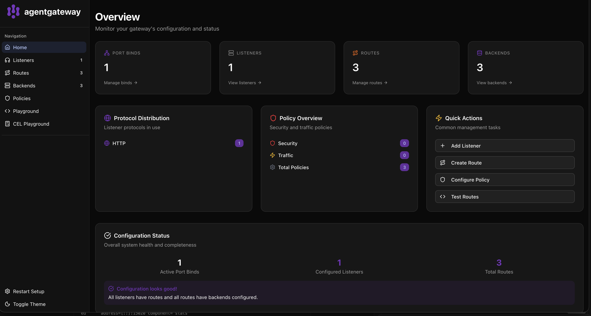
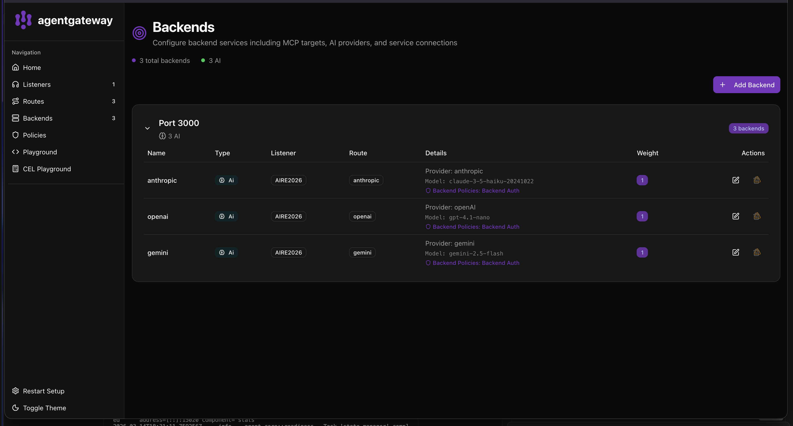
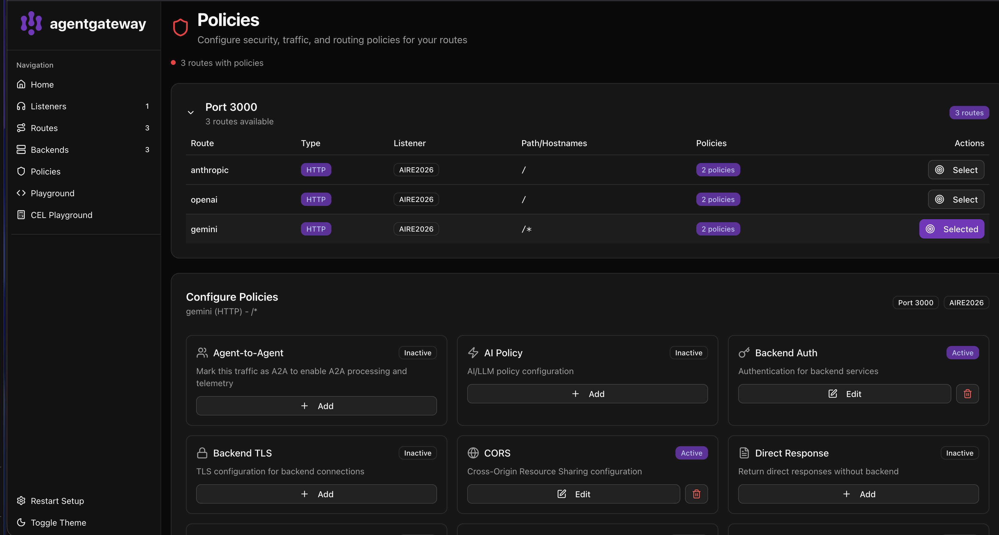

# Lab1 — Beginners: agentgateway with multiple LLM providers

One script installs agentgateway and runs the gateway with three backends: **Gemini**, **Anthropic**, and **OpenAI**.
The provider is chosen with the `x-provider` header. The default is Gemini.

## Quick start

```bash
# 1. Get API keys:
#    Gemini:    https://aistudio.google.com/api-keys
#    Anthropic: https://console.anthropic.com/settings/keys
#    OpenAI:    https://platform.openai.com/api-keys

# 2. Export variables (minimum — Gemini)
export GEMINI_API_KEY=your-gemini-key
export ANTHROPIC_API_KEY=your-anthropic-key   # optional
export OPENAI_API_KEY=your-openai-key         # optional

# 3. Run (installs agentgateway on first run)
./run.sh
```

After startup:

- **UI:**  http://localhost:15000/ui/
- **API:** http://localhost:3000

---

## What `run.sh` does

1. **Installs agentgateway** — [Deploy the binary](https://agentgateway.dev/docs/standalone/latest/deployment/binary/): downloads the `darwin-arm64` (or Linux) binary to `/usr/local/bin/agentgateway`.
2. **Checks API keys** — prints status for each provider.
3. **Starts the gateway** with `config.yaml` and serves the UI at http://localhost:15000/ui/.

---

## Tests

With the gateway running (`./run.sh`), in **another terminal** run:

### Test 1 — Gemini 2.5 Flash (default)

```bash
curl http://localhost:3000/v1/chat/completions \
  -H "Content-Type: application/json" \
  -d '{
    "model": "gemini-2.5-flash",
    "messages": [{"role": "user", "content": "Hi! What is agentgateway?"}]
  }'
```

Example successful response (abbreviated):

```json
{
  "model": "gemini-2.5-flash",
  "usage": {"prompt_tokens": 9, "completion_tokens": 676, "total_tokens": 2244},
  "choices": [{
    "message": {"role": "assistant", "content": "AgentGateway is a software component..."},
    "finish_reason": "stop"
  }],
  "object": "chat.completion"
}
```

### Test 2 — Anthropic Claude (x-provider: anthropic)

```bash
curl http://localhost:3000/v1/chat/completions \
  -H "Content-Type: application/json" \
  -H "x-provider: anthropic" \
  -d '{
    "model": "claude-3-5-haiku-20241022",
    "messages": [{"role": "user", "content": "Hi! What is agentgateway?"}]
  }'
```

### Test 3 — OpenAI GPT (x-provider: openai)

```bash
curl http://localhost:3000/v1/chat/completions \
  -H "Content-Type: application/json" \
  -H "x-provider: openai" \
  -d '{
    "model": "gpt-4.1-nano",
    "messages": [{"role": "user", "content": "Hi! What is agentgateway?"}]
  }'
```

### Test 4 — multi-turn dialog (Gemini)

```bash
curl http://localhost:3000/v1/chat/completions \
  -H "Content-Type: application/json" \
  -d '{
    "model": "gemini-2.5-flash",
    "messages": [
      {"role": "user", "content": "You are a DevOps assistant. Reply briefly."},
      {"role": "assistant", "content": "Understood. Ready to help with DevOps questions."},
      {"role": "user", "content": "What is the Gateway pattern in microservices?"}
    ]
  }'
```

### Test 5 — list available Gemini models

```bash
curl "https://generativelanguage.googleapis.com/v1/models?key=$GEMINI_API_KEY" \
  | python3 -m json.tool | grep '"name"'
```

Confirmed model names include:

```
"name": "models/gemini-2.5-flash"
"name": "models/gemini-2.5-pro"
"name": "models/gemini-2.0-flash"
"name": "models/gemini-2.0-flash-001"
"name": "models/gemini-2.0-flash-lite-001"
"name": "models/gemini-2.0-flash-lite"
"name": "models/gemini-2.5-flash-lite"
```

---

## UI — agentgateway

### Overview (Home)



The home page shows overall gateway health: 1 Port Bind, 1 Listener (`AIRE2026`), 3 Routes, 3 Backends. Status `Configuration looks good!` means every listener has routes and every route has backends.

### Backends



Three AI backends bound to listener `AIRE2026`:

| Name       | Provider  | Model                      | Route     |
|------------|-----------|----------------------------|-----------|
| anthropic  | Anthropic | `claude-3-5-haiku-20241022`| anthropic |
| openai     | OpenAI    | `gpt-4.1-nano`             | openai    |
| gemini     | Gemini    | `gemini-2.5-flash`         | gemini    |

Each backend has a `Backend Auth` policy (the key is injected automatically).

### Policies



Three routes with policies (listener `AIRE2026`, port 3000):

| Route     | Path | Policies                     |
|-----------|------|------------------------------|
| anthropic | `/`  | Backend Auth, CORS           |
| openai    | `/`  | Backend Auth, CORS           |
| gemini    | `/*` | Backend Auth, CORS           |

Active policies on route `gemini`: **Backend Auth** (Active) and **CORS** (Active).

---

## Backends and policy

In the UI (http://localhost:15000/ui/) open **Routes** and **Backends**:

| Backend     | Provider  | Model                    | Route (x-provider)   |
|-------------|-----------|--------------------------|----------------------|
| `gemini`    | Gemini    | `gemini-2.5-flash`       | *(default)*          |
| `anthropic` | Anthropic | `claude-3-5-haiku-20241022` | `anthropic`     |
| `openai`    | OpenAI    | `gpt-4.1-nano`           | `openai`             |

### Policies in `config.yaml`

- **cors** — allows any origin/header (for local testing).
- **backendAuth** — injects the right API key (`$GEMINI_API_KEY`, `$ANTHROPIC_API_KEY`, `$OPENAI_API_KEY`) into upstream requests. The client never sees the key.

More detail:

- [Providers](https://agentgateway.dev/docs/standalone/latest/llm/providers/)
- [Backends](https://agentgateway.dev/docs/standalone/latest/configuration/backends)
- [Security (auth, CORS)](https://agentgateway.dev/docs/standalone/latest/configuration/security)
- [Multiple LLM providers](https://agentgateway.dev/docs/standalone/latest/llm/providers/multiple-llms)

---

## Files

| File          | Description |
|---------------|-------------|
| `run.sh`      | Install agentgateway, check keys, start gateway. |
| `config.yaml` | Three routes/backends (Gemini, Anthropic, OpenAI) with `x-provider` routing. |
| `README.md`   | Instructions, tests, backends and policy overview. |
