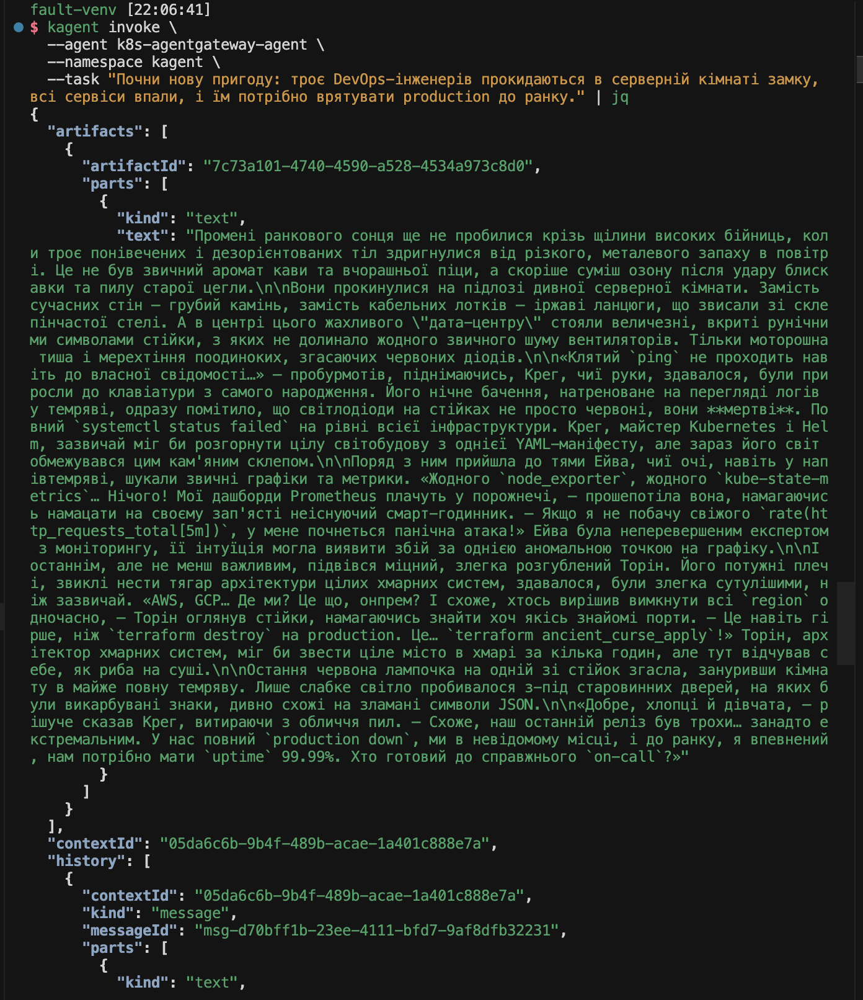
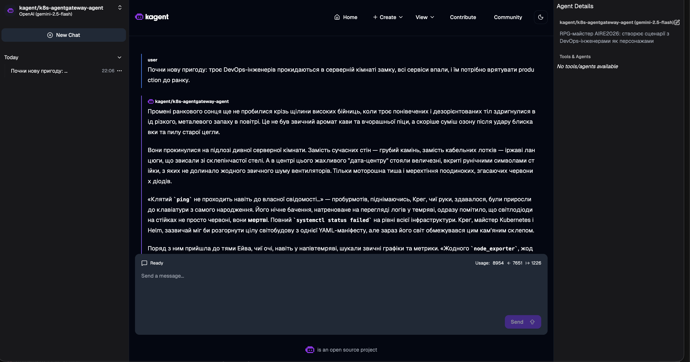
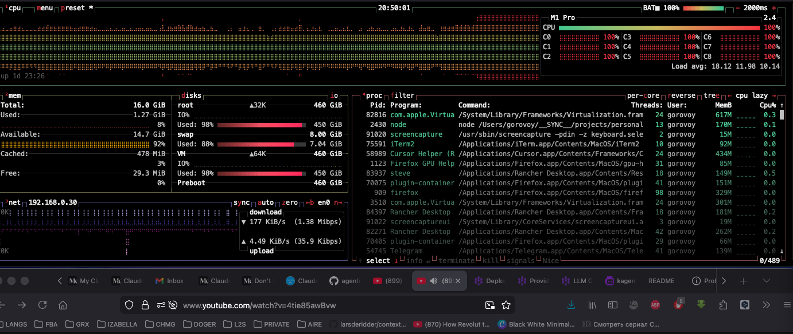
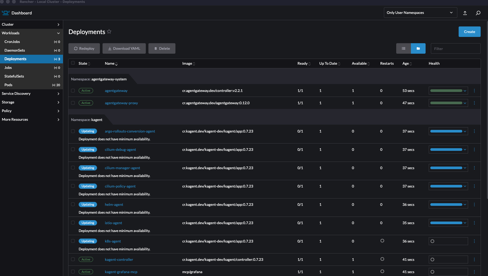
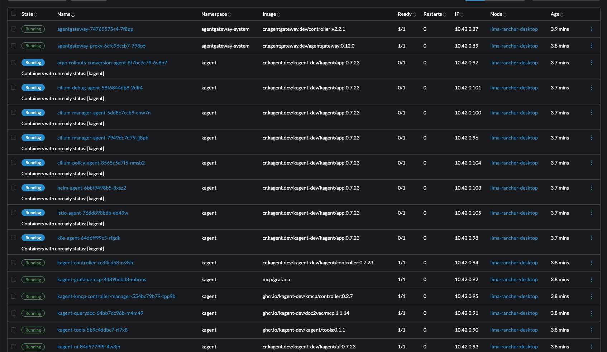
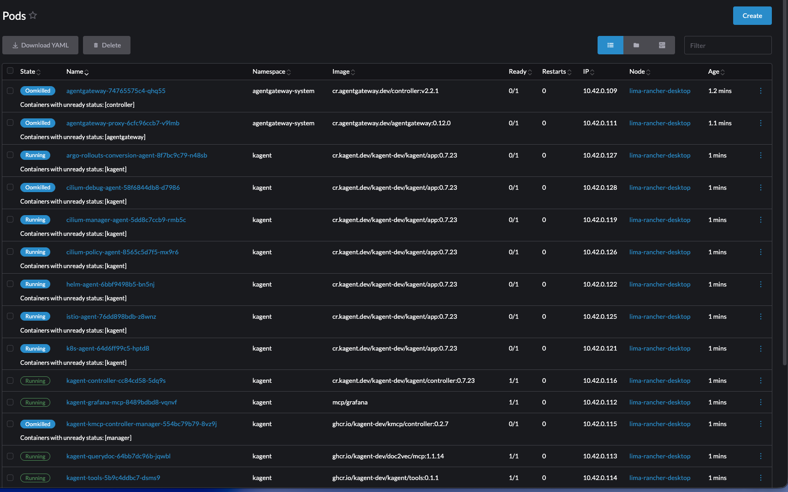
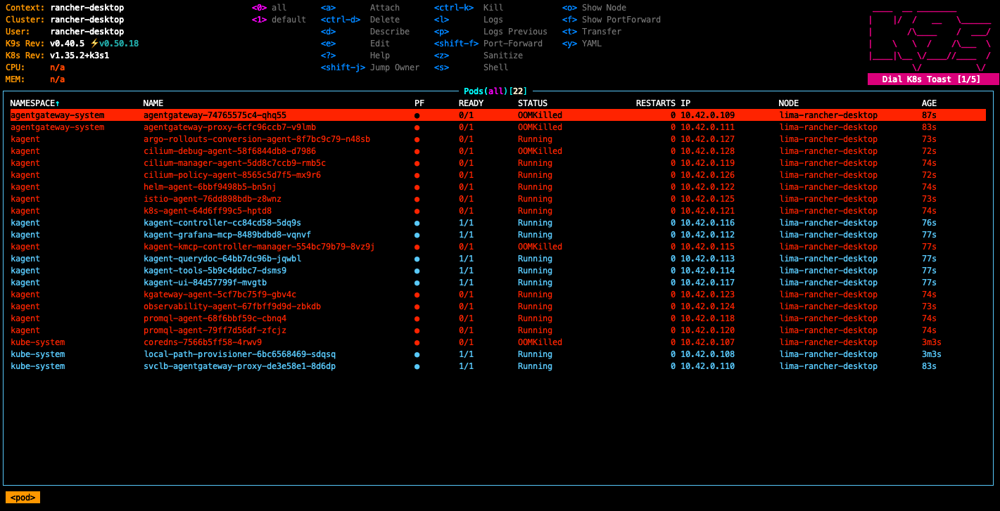

# Lab1 — Medium: agentgateway + kagent on Kubernetes

Helm deploy of agentgateway in a Kubernetes cluster with three LLM backends (Gemini, Anthropic, OpenAI) and kagent integration for AI agents.

## Layout

```
Lab1/medium/
├── run.sh                         # Single deploy script (steps 0–9)
├── README.md
└── k8s/
    ├── agentgateway/
    │   ├── secret.yaml            # Example Secret (reference; run.sh creates per-provider secrets)
    │   ├── configmap.yaml         # ConfigMap: standalone-style config.yaml (reference)
    │   └── gateway.yaml           # Gateway + AgentgatewayBackends + HTTPRoute
    └── kagent/
        ├── kagent-model.yaml      # ModelConfig: agentgateway → Gemini
        └── kagent-agent.yaml      # Agent: k8s-agentgateway-agent
```

## Prerequisites

| Tool       | Install |
|------------|---------|
| `kubectl`  | https://kubernetes.io/docs/tasks/tools/ |
| `helm`     | https://helm.sh/docs/intro/install/ |
| `kagent`   | `brew install kagent` or [get-kagent script](https://kagent.dev/docs/kagent/getting-started/quickstart) |
| K8s cluster | [Rancher Desktop](https://rancherdesktop.io/) (k3s) — assumed available |

Rancher Desktop should be running (context `rancher-desktop`). Verify:

```bash
kubectl config current-context   # should be rancher-desktop
kubectl cluster-info
```

## Quick start

```bash
# 1. API keys (minimum — Gemini)
export GEMINI_API_KEY=your-gemini-key
export ANTHROPIC_API_KEY=your-anthropic-key   # optional
export OPENAI_API_KEY=your-openai-key         # optional

# 2. Deploy
./run.sh
```

---

## What `run.sh` does

| Step | Action |
|------|--------|
| 0 | Check `kubectl`, `helm`, `kagent`, cluster connectivity |
| 1 | Check API keys |
| 2 | Install [Gateway API CRDs](https://gateway-api.sigs.k8s.io/) v1.4.0 |
| 3 | Helm install `agentgateway-crds` + `agentgateway` v2.2.1 |
| 4 | Create `gemini-secret`, `anthropic-secret`, `openai-secret` in `agentgateway-system` |
| 5 | Apply `Gateway` + `AgentgatewayBackend` (gemini/anthropic/openai) + `HTTPRoute` |
| 6 | Helm install kagent with **demo agents disabled** (core only) |
| 7 | `ModelConfig` (agentgateway→Gemini) + `Agent` `k8s-agentgateway-agent` |
| 8 | Ingress for kagent UI and agentgateway |
| 9 | Print status and access hints |

---

## Architecture

```
┌─────────────────────────────────────────────────────────────────┐
│  Kubernetes cluster                                             │
│                                                                 │
│  ┌──────────────┐    HTTPRoute     ┌─────────────────────────┐  │
│  │    kagent    │ ──────────────▶  │   agentgateway-proxy    │  │
│  │  (AI agents) │                  │   (Gateway API, :8080)    │  │
│  └──────────────┘                  └───────────┬─────────────┘  │
│        │                                       │                │
│        │ ModelConfig                   x-provider header        │
│        ▼                               ┌───────┴───────┐        │
│  agentgateway-proxy                    ▼               ▼        │
│  (via svc URL)                ┌────────────┐  ┌──────────────┐  │
│                               │   gemini   │  │  anthropic   │  │
│                               │ (default)  │  │   openai     │  │
│                               └─────┬──────┘  └──────┬───────┘  │
└─────────────────────────────────────┼────────────────┼──────────┘
                                      ▼                ▼
                              Gemini API       Anthropic / OpenAI API
```

---

## Tests

### Port-forward for local access

```bash
kubectl port-forward deployment/agentgateway-proxy \
  -n agentgateway-system 8080:8080
```

> **Rancher Desktop (k3s):** port 80 is often used by Traefik. This Gateway listens on **8080**.

### Test 1 — Gemini (default)

```bash
curl localhost:8080/v1/chat/completions \
  -H "Content-Type: application/json" \
  -d '{
    "model": "gemini-2.5-flash",
    "messages": [{"role": "user", "content": "Hi! What is Kubernetes?"}]
  }'
```

### Test 2 — Anthropic (`x-provider` header)

```bash
curl localhost:8080/v1/chat/completions \
  -H "Content-Type: application/json" \
  -H "x-provider: anthropic" \
  -d '{
    "model": "claude-3-5-haiku-20241022",
    "messages": [{"role": "user", "content": "Hi!"}]
  }'
```

### Test 3 — OpenAI (`x-provider` header)

```bash
curl localhost:8080/v1/chat/completions \
  -H "Content-Type: application/json" \
  -H "x-provider: openai" \
  -d '{
    "model": "gpt-4.1-nano",
    "messages": [{"role": "user", "content": "Hi!"}]
  }'
```

### Test 4 — kagent dashboard

```bash
kagent dashboard
# Opens http://localhost:8082 (port may vary)
```

### Test 5 — `kagent invoke` (custom agent)

Demo agents including `helm-agent` are **disabled** by this script. Invoke the lab agent:

```bash
kagent get agent

kagent invoke \
  -t "What pods are running in namespace agentgateway-system?" \
  --agent k8s-agentgateway-agent
```

### Cluster resource checks

```bash
# All agentgateway resources
kubectl get all -n agentgateway-system

# Backends and HTTPRoutes
kubectl get agentgatewaybackend -n agentgateway-system
kubectl get httproute -n agentgateway-system

# Gateway status
kubectl get gateway agentgateway-proxy -n agentgateway-system

# kagent agents
kubectl get agent -n kagent
kubectl get modelconfig -n kagent
```

---

## Secrets and ConfigMap

### Per-provider Secrets

`run.sh` creates three secrets in `agentgateway-system`, each with key `Authorization`:

```bash
kubectl create secret generic gemini-secret \
  --namespace agentgateway-system \
  --from-literal=Authorization="${GEMINI_API_KEY}"
# anthropic-secret / openai-secret similarly (placeholders allowed if unused)
```

A `gemini-secret` is also created in the `kagent` namespace for the ModelConfig.

> **Production:** prefer [Sealed Secrets](https://github.com/bitnami-labs/sealed-secrets) or External Secrets instead of committing `stringData` in YAML.

### ConfigMap (`agentgateway-config`)

`k8s/agentgateway/configmap.yaml` is standalone-style reference config. On Kubernetes, agentgateway is driven by `AgentgatewayBackend` and `HTTPRoute`; the controller builds the effective config.

---

## Cleanup

```bash
# Remove agentgateway
helm uninstall agentgateway agentgateway-crds -n agentgateway-system
kubectl delete namespace agentgateway-system

# Remove kagent
kagent uninstall
kubectl delete namespace kagent

# kind cluster (if you used kind)
kind delete cluster
```

---

## Screenshots

### Successful run — `kagent invoke` (CLI)



> `kagent invoke` against `k8s-agentgateway-agent`: an RPG-style prompt with DevOps characters. The agent (gemini-2.5-flash via agentgateway) returned a full JSON response with `artifacts[].parts[].text`, confirming `kagent → agentgateway-proxy → Gemini API`.

---

### Successful run — kagent UI



> kagent UI — same style of chat. Agent `kagent/k8s-agentgateway-agent` (gemini-2.5-flash) replies in the thread. **Agent Details** shows the connected model and the AIRE2026 RPG persona.

---

### 1. Cluster overload — CPU 100% (demo agents)



> Installing kagent with the `demo` profile saturated all CPU cores. k3s kine/SQLite could not keep up with API traffic from 10+ demo agents. **Fix:** use `--profile minimal` or Helm with `agents.<name>.enabled=false` (as in `run.sh`).

---

### 2. Rancher Desktop — Deployments after deploy



> `agentgateway-system`: both deployments **Active** (1/1). In `kagent`, demo agents could sit in **Updating** when the API server or node is overloaded.

---

### 3. Rancher Desktop — Pods Running



> Pods **Running**: `agentgateway`, `agentgateway-proxy`, `kagent-controller`, `kagent-ui`, `kagent-tools`, `kagent-grafana-mcp`, plus demo agents when enabled.

---

### 4. Rancher Desktop — OOMKilled



> Under memory pressure, demo agents and `agentgateway` could become **OOMKilled** when the Lima VM RAM limit is too low.

---

### 5. k9s — many pods OOMKilled



> Typical view when Rancher Desktop + k3s + SQLite runs the full demo stack on limited resources.

> **Takeaway:** raise Rancher Desktop VM RAM (e.g. ≥8GB) or deploy a **minimal** kagent stack only.

---

## Links

- [agentgateway Kubernetes Quickstart](https://agentgateway.dev/docs/kubernetes/latest/quickstart/install)
- [agentgateway LLM on K8s](https://agentgateway.dev/docs/kubernetes/latest/quickstart/llm)
- [kagent Quickstart](https://kagent.dev/docs/kagent/getting-started/quickstart)
- [Gateway API](https://gateway-api.sigs.k8s.io/)
- [Helm Charts agentgateway](https://agentgateway.dev/docs/kubernetes/latest/reference/helm)
