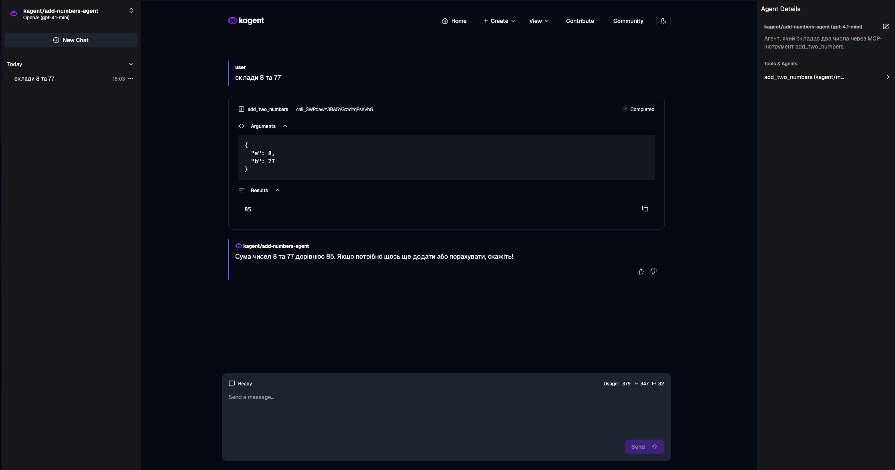
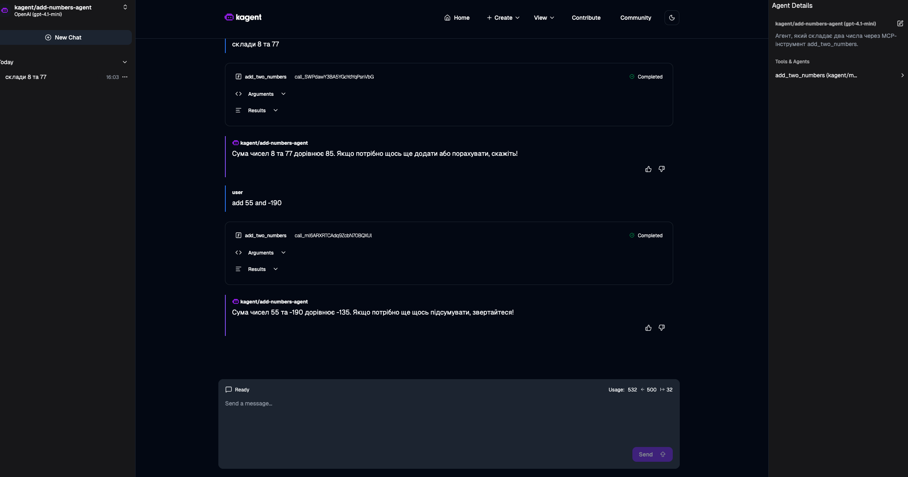
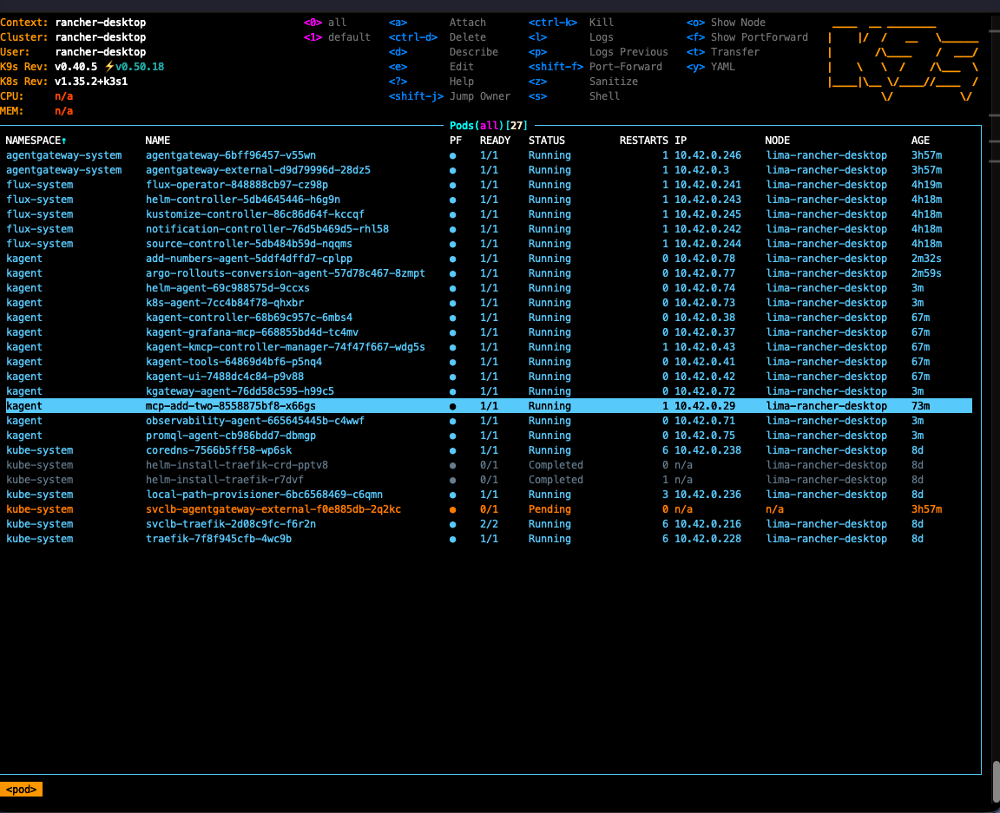

# Lab #2 (Rancher Desktop + abox)

This document covers items **2–3** for the **beginner** track, after a successful `make run` / `tofu apply` and Flux `READY`.

---

## 2. Access to Flux, kagent UI, and agentgateway

### Flux (GitOps status)

#### Web UI: Flux Status Web UI (Flux Operator)

**Control Plane Flux Operator** includes **Flux Status** (GitOps overview). By default it listens on port **9080** in the operator pod.

Find the service (name may match `flux-operator` release):

```bash
kubectl get svc -n flux-system
```

Typical access from the laptop (Rancher Desktop):

```bash
kubectl -n flux-system port-forward svc/flux-operator 9080:9080
```

Open in browser: **http://127.0.0.1:9080/**

If `svc/flux-operator` is missing, list exact names:

```bash
kubectl get svc -n flux-system -l app.kubernetes.io/name=flux-operator
# or
kubectl get pods -n flux-system -l app.kubernetes.io/name=flux-operator -o wide
```

Deploy **only** the UI (without another operator) from a second Helm release if needed — see [flux-operator chart: `web.serverOnly`](https://artifacthub.io/packages/helm/flux-operator/flux-operator).

#### CLI and kubectl (no browser)

| What | How |
|------|-----|
| Resource overview | `bash scripts/flux.sh get all` or `flux get all` (after [flux setup in zsh](../README.md#troubleshooting)) |
| Interactive | `k9s -n flux-system` (if installed) |
| Events / details | `kubectl get kustomization,helmrelease,ocirepository -n flux-system` |

Source-controller metrics (not UI):

```bash
kubectl -n flux-system port-forward svc/source-controller 9090:9090
# http://127.0.0.1:9090/metrics
```

### Kagent UI + agentgateway (single entry)

Traffic goes through **Gateway** `agentgateway-external` and **HTTPRoute** `kagent` (`/` → UI `:8080`, `/api` → controller `:8083`).

On Rancher Desktop **LoadBalancer** often stays `<pending>`. Most stable access:

```bash
kubectl -n agentgateway-system port-forward svc/agentgateway-external 8080:80
```

Open: **http://127.0.0.1:8080/** — **kagent UI** via agentgateway.

Alternative (if NodePort is reachable from the host):

```bash
kubectl get svc -n agentgateway-system agentgateway-external
# try curl to NodePort on 80, e.g. http://127.0.0.1:<nodePort>/
```

kagent CLI dashboard (if `kagent` is installed locally):

```bash
kagent dashboard
```

(see [kagent docs](https://kagent.dev/docs/kagent/getting-started/first-mcp-tool).)

**agentgateway** is the controller + Gateway; there is no separate “admin UI” in a minimal HelmRelease — use `kubectl get gateway,httproute -A` and pod logs in `agentgateway-system`.

---

## 3. Model, declarative MCP tool server, and agent

### 3.1 Connect a model (OpenAI by default)

`releases/kagent.yaml` uses provider `openAI` and **`OPENAI_API_KEY`**. Create a Secret in namespace `kagent` (name depends on the Helm chart; verify after install):

```bash
kubectl get helmrelease kagent -n kagent -o yaml | grep -i secret
kubectl get pods,secret -n kagent
```

Typical pattern — secret with key `OPENAI_API_KEY`:

```bash
kubectl create secret generic kagent-provider-openai -n kagent \
  --from-literal=OPENAI_API_KEY="sk-..." \
  --dry-run=client -o yaml | kubectl apply -f -
```

If the release expects a **different** Secret name — check HelmRelease values or kagent chart `0.7.23` docs and patch accordingly.

Ensure a **ModelConfig** exists (often `default-model-config`):

```bash
kubectl get modelconfigs -n kagent
```

More: [Your First Agent](https://kagent.dev/docs/kagent/getting-started/first-agent).

### 3.2 Declarative MCP server

Create **`MCPServer`** (`kagent.dev/v1alpha1` or your cluster version):

```bash
kubectl api-resources | grep -i mcp
```

Options: packaged server via `uvx` / `npx` ([example with `mcp-server-fetch`](https://kagent.dev/docs/kagent/getting-started/first-mcp-tool)) or **custom image** with FastMCP ([kmcp: deploy server](https://kagent.dev/docs/kmcp/deploy/server)).

#### Lab example: MCP “add two numbers”

In this repo:

- code and Dockerfile: [`docs/examples/add-two-mcp/`](../examples/add-two-mcp/) — tool **`add_two_numbers(a, b)`** (Python FastMCP);
- **canonical manifests** and steps: [`manifests/kagent/add-two-mcp/README.md`](../manifests/kagent/add-two-mcp/README.md).

Files under `manifests/kagent/add-two-mcp/`:

| File | Purpose |
|------|---------|
| `all-in-one.yaml` | `MCPServer` + `Agent` in one `kubectl apply` |
| `mcpserver.yaml` / `agent.yaml` | separate, staged deploy |
| `kustomization.yaml` | `kubectl apply -k manifests/kagent/add-two-mcp` |

1. Build image (from **Lab2 root**):

   ```bash
   docker build -t add-two-mcp:latest docs/examples/add-two-mcp
   ```

   **Rancher Desktop without registry:** if the MCP pod is `ImagePullBackOff` after `kubectl apply`, load the image into the VM via `rdctl` (full steps in [`manifests/kagent/add-two-mcp/README.md`](../manifests/kagent/add-two-mcp/README.md), subsection “Without Docker registry”):

   ```bash
   docker save add-two-mcp:latest -o "$HOME/add-two-mcp.tar"
   rdctl shell -- sh -lc 'sudo docker load -i '"$HOME"'/add-two-mcp.tar'
   kubectl delete pod -n kagent -l app.kubernetes.io/name=mcp-add-two
   kubectl get pods -n kagent | grep mcp-add-two
   ```

2. Apply manifests (see manifest README):

   ```bash
   kubectl apply -f manifests/kagent/add-two-mcp/all-in-one.yaml
   ```

   Or symlink: [`docs/examples/add-two-mcp/k8s.yaml`](../examples/add-two-mcp/k8s.yaml) → `all-in-one.yaml`.

   **`MCPServer`** fragment (tool name must match `server.py` — here `add_two_numbers`):

   ```yaml
   apiVersion: kagent.dev/v1alpha1
   kind: MCPServer
   metadata:
     name: mcp-add-two
     namespace: kagent
   spec:
     deployment:
       image: add-two-mcp:latest
       imagePullPolicy: IfNotPresent
       port: 3000
       cmd: python
       args:
         - /app/server.py
     stdioTransport: {}
     transportType: stdio
   ```

3. Verify:

   ```bash
   kubectl get mcpservers -n kagent
   kubectl get pods -n kagent | grep -i add-two
   ```

   Adjust `apiVersion` for `MCPServer`/`Agent` per `kubectl explain mcpserver` / `kubectl explain agent` if CRD versions differ.

### 3.3 Declarative agent

Create **`Agent`** with `spec.type: Declarative`, `modelConfig`, and `tools` → your **`MCPServer`** with `toolNames`.

#### Example: “add two numbers” agent

Uses `MCPServer` `mcp-add-two` and tool `add_two_numbers` only:

```yaml
apiVersion: kagent.dev/v1alpha2
kind: Agent
metadata:
  name: add-numbers-agent
  namespace: kagent
spec:
  description: Agent that adds two numbers via MCP tool add_two_numbers.
  type: Declarative
  declarative:
    modelConfig: default-model-config
    systemMessage: |
      You are a helpful assistant. You have tool add_two_numbers(a, b) — sum of two integers.
      When the user asks to add, sum, or combine two numbers, call this tool with a and b.
      If numbers are unclear, ask. Reply in Markdown and briefly explain the result.
    tools:
      - type: McpServer
        mcpServer:
          apiGroup: kagent.dev
          name: mcp-add-two
          kind: MCPServer
          toolNames:
            - add_two_numbers
```

Apply (current dir — **Lab2 root**):

```bash
kubectl apply -f manifests/kagent/add-two-mcp/all-in-one.yaml
```

(Same as: `kubectl apply -f docs/examples/add-two-mcp/k8s.yaml`.)

Verify:

```bash
kubectl get agents -n kagent
kubectl describe agent add-numbers-agent -n kagent
```

Chat in UI — after port-forward to **8080** (above); select **add-numbers-agent** and try e.g. *“Add 17 and 25”*.

More: [Use MCP servers and tools in kagent](https://kagent.dev/docs/kagent/getting-started/first-mcp-tool).

---

## Screenshots

Images live in **`images/lab/`** (you can copy from macOS `~/Movies/Screenshot … .png`).

### Success (kagent + MCP `add_two_numbers`)

After model Secret with `OPENAI_API_KEY`, deploy `mcp-add-two` and `add-numbers-agent`:

1. **kagent UI** — prompt *“add 8 and 77”*, tool `add_two_numbers` with `a: 8`, `b: 77`, result **85**.

   

2. **kagent UI** — multiple successful turns (including negative number).

   

3. **k9s** — pods in `kagent` `Running` / `Ready`, including `mcp-add-two` and `add-numbers-agent`.

   

---

### Other lab steps

1. 
2. 
3. 

4. 

5. 
6. 
7. 
8. 

---

## References

- [kagent — first MCP tool](https://kagent.dev/docs/kagent/getting-started/first-mcp-tool)
- [abox README](../README.md) — bootstrap, Flux, troubleshooting
