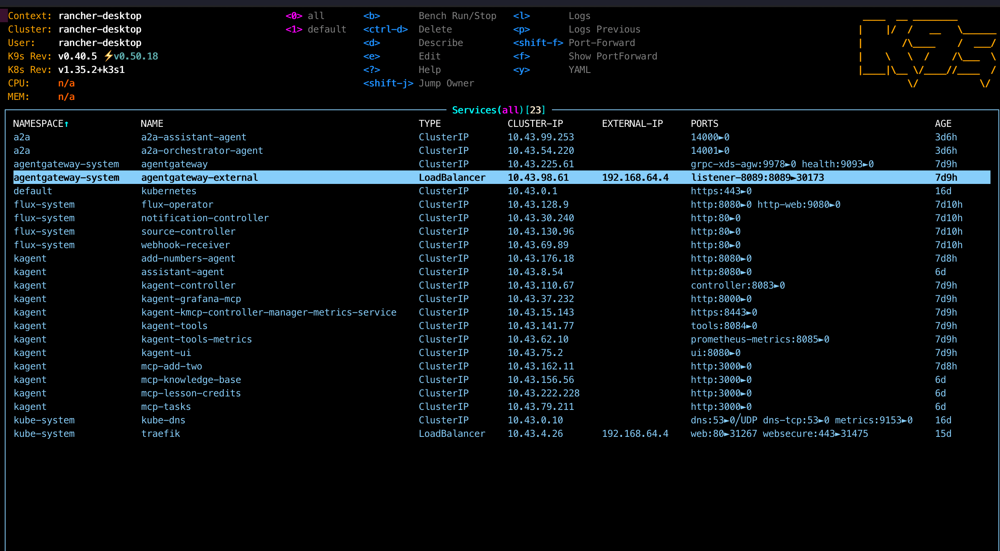
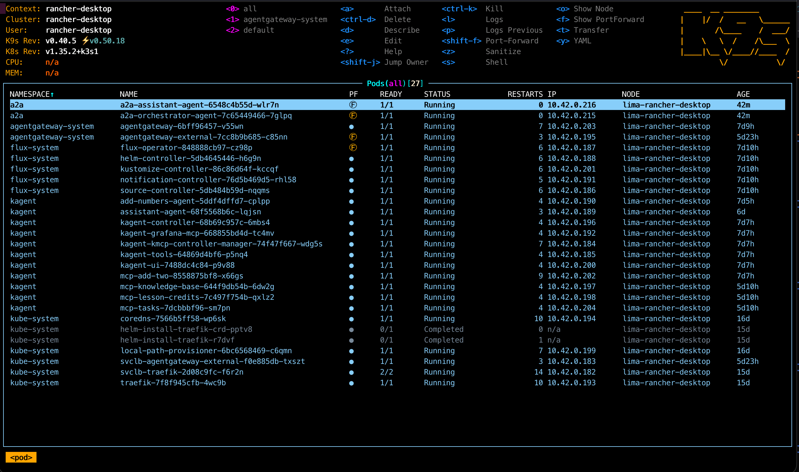

# Lab 4 — A2A Protocol: Agent-to-Agent Communication

> **Goal:** learn the A2A (Agent-to-Agent) protocol, implement an agent with an Agent Card and Well-Known URI, configure inter-agent communication, and deploy an AI resource inventory in the cluster.

## A2A Protocol — overview

**A2A (Agent2Agent)** is an open protocol for standardized communication between AI agents. Developed by Google and contributed to the Linux Foundation. Supported by 150+ organizations.

### Key differences from MCP

| Aspect | MCP | A2A |
|--------|-----|-----|
| **Focus** | Agent ↔ Tools/Data | Agent ↔ Agent |
| **Model** | Agent calls tools | Agents communicate as peers |
| **Discovery** | Client configuration | Well-Known URI (`/.well-known/agent-card.json`) |
| **Protocol** | JSON-RPC (stdio/SSE) | JSON-RPC (HTTP/gRPC) |
| **State** | Stateless tool calls | Stateful Tasks (lifecycle) |

### Core A2A concepts

```
┌─────────────────────────────────────────────────────────────┐
│                    A2A Protocol Flow                         │
│                                                              │
│  1. Discovery:  GET /.well-known/agent-card.json            │
│  2. Send Task:  POST / (JSON-RPC: message/send)             │
│  3. Get Task:   POST / (JSON-RPC: tasks/get)                │
│  4. Cancel:     POST / (JSON-RPC: tasks/cancel)             │
└─────────────────────────────────────────────────────────────┘

Agent Card — JSON metadata for an agent:
  - name, description, version
  - skills[] — agent capabilities
  - capabilities — streaming, push notifications
  - `url` + `preferredTransport` — primary endpoint; `additionalInterfaces[]` — `transport` + `url`
  - securitySchemes — authentication

Task States:
  CREATED → WORKING → COMPLETED
                    → FAILED
                    → CANCELED
           → INPUT_REQUIRED → WORKING → ...
           → AUTH_REQUIRED → WORKING → ...
           → REJECTED
```

## Lab 4 architecture

```
┌───────────────────────────────────────────────────────────┐
│                     User / Client                         │
└──────────────────────┬────────────────────────────────────┘
                       │ A2A JSON-RPC
          ┌────────────▼────────────┐
          │   Orchestrator Agent    │  (port 14001)
          │   /.well-known/         │
          │    agent-card.json      │
          │                         │
          │   Skills:               │
          │   - orchestration       │
          │   (→ assistant A2A)     │
          └────────────┬────────────┘
                       │ 1. GET /.well-known/agent-card.json
                       │ 2. POST message/send
          ┌────────────▼────────────┐
          │   Assistant Agent       │  (port 14000)
          │   /.well-known/         │
          │    agent-card.json      │
          │                         │
          │   Skills:               │
          │   - knowledge_base      │
          │   - lesson_credits      │
          │   - task_manager        │
          └──┬──────┬───────┬───────┘
             │      │       │
         ┌───▼──┐┌──▼──┐┌───▼───┐
         │ KB   ││Less.││ Tasks │  (Lab3 MCP backends)
         │ API  ││Cred.││ Mgr   │
         └──────┘└─────┘└───────┘
```

## Lab 4 layout

```
Lab4/
├── LAB4.md                              ← this file
├── a2a-agents/
│   ├── requirements.txt                 ← a2a-sdk[http-server], uvicorn, httpx
│   ├── docker-compose.yaml              ← run both agents locally
│   ├── Dockerfile.assistant             ← assistant agent image
│   ├── Dockerfile.orchestrator          ← orchestrator agent image
│   ├── test_a2a.py                      ← test client (same logic as curl)
│   ├── a2a_http_client.py               ← JSON-RPC message/send + response parsing
│   ├── requirements-dev.txt             ← pytest (unit tests)
│   ├── tests/
│   │   └── test_a2a_http_client.py      ← unit tests for request/response shape
│   ├── mcp/
│   │   └── knowledge_base_server.py     ← stdio MCP server (Lab3-compatible KB tools)
│   └── src/
│       ├── assistant-agent/
│       │   ├── __main__.py              ← Agent Card + A2A server setup
│       │   ├── agent_executor.py        ← AgentExecutor → MCP call_tool routing
│       │   └── mcp_stdio_hub.py         ← MCP stdio client(s) + optional Lab3 servers
│       └── orchestrator-agent/
│           ├── __main__.py              ← Agent Card + A2A server setup
│           └── agent_executor.py        ← Discovery + delegation via A2A
├── manifests/
│   ├── k8s/
│   │   ├── namespace.yaml               ← namespace: a2a
│   │   ├── secrets-example.yaml         ← secrets template
│   │   ├── assistant-agent.yaml         ← Deployment + Service
│   │   ├── orchestrator-agent.yaml      ← Deployment + Service
│   │   └── kustomization.yaml           ← Kustomize manifest
│   └── inventory/
│       └── abox-inventory.yaml          ← ConfigMap listing AI resources
└── docs/                                ← screenshots and extra documentation
```

## Components

### 1. Assistant Agent (A2A Server)

**File:** `a2a-agents/src/assistant-agent/__main__.py`

Wraps **Lab3-compatible MCP tools** (stdio MCP) in the A2A protocol:

- **Agent Card** with three skills (knowledge_base, lesson_credits, task_manager)
- **Well-Known URI**: `GET http://127.0.0.1:14000/.well-known/agent-card.json` (assistant port in the 14xxx range)
- **A2A endpoint**: `POST http://127.0.0.1:14000/` (or env `A2A_ASSISTANT_PORT` / `A2A_TEST_*_URL`)
- Uses `a2a-sdk`: `A2AStarletteApplication`, `DefaultRequestHandler`, `InMemoryTaskStore`

**MCP integration** (`mcp_stdio_hub.py` + `mcp/knowledge_base_server.py`):
- **Knowledge Base** — always uses a bundled MCP server process (same tool names as Lab3: `kb_list_documents`, `kb_get_document`, `kb_graph_get`, `kb_graph_rebuild`, `kb_edit_document`). The assistant runs an MCP **client** over stdio to that subprocess.
- **Lesson Credits / Task Manager** — Docker image includes `server.py` from `Lab3/mcp-servers` under `/opt/lab3-runtime` (Lab3-style `mcp-servers-*` paths). Mount `agents/`, `core/`, and `scripts/` from your full agentic-ai project (`docker-compose.lab3-mcp.yaml` + `LAB3_AGENTIC_ROOT`). Install that project’s Python dependencies into the image (extend Dockerfile or custom `FROM`) so imports resolve. Set `MCP_*_SCRIPT` to empty in the environment to disable lesson/tasks MCP.

**AgentExecutor** (`agent_executor.py`):
- Handles incoming A2A messages → extracts text from `message.parts` (SDK model)
- Keyword routing → `call_tool` on the appropriate MCP session (not raw HTTP in Python)
- Returns results as `TaskArtifactUpdateEvent` (TextPart)

### 2. Orchestrator Agent (A2A Client + Server)

**File:** `a2a-agents/src/orchestrator-agent/__main__.py`

Orchestrator — single client entry point over A2A:

- **Delegation**: all requests go **only** to the Personal Assistant Agent (`A2A_ASSISTANT_URL`); the orchestrator does not call MCP
- **Assistant** performs work with tools and external systems (as in Lab3)
- **Discovery**: the `discover` command shows the assistant’s Agent Card (downstream)

### 3. Kubernetes manifests

- **Namespace** `a2a` for isolation from the kagent namespace
- **Deployments** with health checks via `/.well-known/agent-card.json`
- **Services** (ClusterIP) for in-cluster communication
- Orchestrator reaches the assistant via `A2A_ASSISTANT_URL`; in-cluster: `http://a2a-assistant-agent.a2a.svc.cluster.local:14000`

**k9s — cluster view (Rancher Desktop, example):** Services list shows `a2a-assistant-agent` and `a2a-orchestrator-agent` in namespace `a2a`, alongside kagent MCP services, Traefik, and Agent Gateway.





### 4. Inventory

ConfigMap `ai-inventory-config` in namespace `kagent` — list of AI resources in the cluster:
- Agents (kagent Lab3 + A2A Lab4)
- MCP servers
- Infrastructure components

## Quick start

### Prerequisites

- Python 3.12+
- Docker + Docker Compose (for containerized runs)
- kubectl + cluster access (for K8s deployment)

### Local run

```bash
cd Lab4/a2a-agents

# 1. Create virtualenv
python -m venv .venv
source .venv/bin/activate

# 2. Install dependencies
pip install -r requirements.txt

# 3. Start Assistant Agent (terminal 1)
cd src/assistant-agent
python __main__.py
# → Agent Card: http://127.0.0.1:14000/.well-known/agent-card.json

# 4. Start Orchestrator Agent (terminal 2)
cd src/orchestrator-agent
# A2A_ASSISTANT_URL=http://127.0.0.1:14000
python __main__.py
# → Agent Card: http://127.0.0.1:14001/.well-known/agent-card.json
```

### Docker Compose

Agent ports: **14000** (assistant) and **14001** (orchestrator) — 14xxx range, separate from typical services on 9000 (e.g. MinIO).

```bash
cd Lab4/a2a-agents
docker compose up --build
```

### Verify Agent Card (Well-Known URI)

```bash
# Assistant Agent Card (compose)
curl -s http://127.0.0.1:14000/.well-known/agent-card.json | jq .

# Orchestrator Agent Card (compose)
curl -s http://127.0.0.1:14001/.well-known/agent-card.json | jq .
```

Expected shape (assistant):
```json
{
  "name": "Personal Assistant Agent",
  "description": "Personal AI assistant with access to Knowledge Base...",
  "version": "1.0.0",
  "skills": [
    {"id": "knowledge_base", "name": "Knowledge Base", ...},
    {"id": "lesson_credits", "name": "Lesson Credits", ...},
    {"id": "task_manager", "name": "Task Manager", ...}
  ],
  "capabilities": {"streaming": false, "push_notifications": false},
  "url": "http://127.0.0.1:14000/",
  "preferredTransport": "JSONRPC",
  "additionalInterfaces": [{"transport": "JSONRPC", "url": "http://127.0.0.1:14000/"}]
}
```

### Sending an A2A task

In **a2a-sdk 0.3.x** the JSON-RPC method is **`message/send`**. The message body must include **`kind`: `"message"`**, **`messageId`** (UUID), and in **`parts`** use **`kind`: `"text"`** (not legacy `a2a.SendMessage` / `type: text`). To wait for task completion, set **`configuration.blocking`: true**.

```bash
# Send a message to the Assistant Agent (compose)
# Replace messageId with your own UUID (uuidgen / python -c "import uuid; print(uuid.uuid4())")
curl -s -X POST http://127.0.0.1:14000/ \
  -H "Content-Type: application/json" \
  -d '{
    "jsonrpc": "2.0",
    "id": "1",
    "method": "message/send",
    "params": {
      "message": {
        "kind": "message",
        "role": "user",
        "messageId": "550e8400-e29b-41d4-a716-446655440000",
        "parts": [{"kind": "text", "text": "Show the list of documents"}]
      },
      "configuration": {"blocking": true}
    }
  }' | jq .
```

### Inter-agent flow (Orchestrator → Assistant)

```bash
# Orchestrator discovery
curl -s -X POST http://127.0.0.1:14001/ \
  -H "Content-Type: application/json" \
  -d '{
    "jsonrpc": "2.0",
    "id": "1",
    "method": "message/send",
    "params": {
      "message": {
        "kind": "message",
        "role": "user",
        "messageId": "550e8400-e29b-41d4-a716-446655440001",
        "parts": [{"kind": "text", "text": "discover"}]
      },
      "configuration": {"blocking": true}
    }
  }' | jq .

# Orchestrator delegates to the Assistant
curl -s -X POST http://127.0.0.1:14001/ \
  -H "Content-Type: application/json" \
  -d '{
    "jsonrpc": "2.0",
    "id": "2",
    "method": "message/send",
    "params": {
      "message": {
        "kind": "message",
        "role": "user",
        "messageId": "550e8400-e29b-41d4-a716-446655440002",
        "parts": [{"kind": "text", "text": "Show the list of documents"}]
      },
      "configuration": {"blocking": true}
    }
  }' | jq .
```

### Test script

By default the script targets **`http://127.0.0.1:14000`** / **`:14001`** with **`trust_env=False`** (no proxy for localhost).

For **Kubernetes**, use **port-forward** to the same local ports (or others + env):

```bash
kubectl port-forward -n a2a svc/a2a-assistant-agent 14000:14000 &
kubectl port-forward -n a2a svc/a2a-orchestrator-agent 14001:14001 &
python test_a2a.py discover
```

If **14000/14001** are busy, forward to free ports, e.g. `kubectl port-forward ... 24000:14000` and set `A2A_TEST_ASSISTANT_URL=http://127.0.0.1:24000`.

```bash
# Test assistant
python test_a2a.py assistant

# Test orchestrator (delegation)
python test_a2a.py orchestrator

# Discover both agents
python test_a2a.py discover

# Minimal smoke (agent card + one message/send to assistant), exit code 0/1
python test_a2a.py smoke
```

### Tests and sample responses

**Unit tests** (`message/send` shape and text extraction from `Task` / `Message`):

```bash
cd Lab4/a2a-agents
pip install -r requirements-dev.txt
python -m pytest tests/test_a2a_http_client.py -v
```

Expected output (abbreviated): `5 passed`.

**Example success response** (camelCase fields; structure depends on the agent; often a **`kind`: `"task"`** object with **`artifacts[].parts[]`** or updates in **`status.message`**):

```json
{
  "jsonrpc": "2.0",
  "id": "1",
  "result": {
    "kind": "task",
    "id": "...",
    "contextId": "...",
    "status": {
      "state": "completed",
      "message": null
    },
    "artifacts": [
      {
        "artifactId": "...",
        "name": "response",
        "parts": [
          {
            "kind": "text",
            "text": "Agent reply text (e.g. document list from KB)..."
          }
        ]
      }
    ]
  }
}
```

If the server returns **`"error": {"code": -32601, "message": "Method not found"}`**, ensure the request uses **`"method": "message/send"`** and the current **`params.message`** shape (see `curl` examples above). **`test_a2a.py`** prints a **“Extracted reply text”** block after the raw JSON — same logic as the orchestrator (`a2a_http_client.py`).

## Kubernetes deployment

### Build Docker images

```bash
cd Lab4/a2a-agents

# Build images
docker build -f Dockerfile.assistant -t a2a-assistant-agent:latest .
docker build -f Dockerfile.orchestrator -t a2a-orchestrator-agent:latest .
```

### Rancher Desktop: images for Kubernetes

**Important: one context for Docker and for the cluster.** If `kubectl` points at **Rancher Desktop** but `docker build` runs in **Docker Desktop** (build logs show `docker-desktop://...`), the image lands in the wrong store: `nerdctl -n k8s.io load` then looks for the k3s socket (`/run/k3s/containerd/...`) and fails, and RD pods cannot see the image.

Before building, verify and switch Docker context to Rancher Desktop if needed:

```bash
docker context ls
docker context use rancher-desktop   # or: docker --context rancher-desktop build ...
kubectl config current-context       # should be rancher-desktop (or your RD k3s)
```

Then depends on **Container engine** under Preferences → Container Engine:

**1. Moby (dockerd)** — simplest for the lab: after `docker context use rancher-desktop`, `docker build` is enough; Kubernetes uses the same local store. **No** `nerdctl load`. Keep `imagePullPolicy: IfNotPresent` in Deployments.

**2. containerd + nerdctl** — pod images must be in the **`k8s.io`** namespace ([docs](https://docs.rancherdesktop.io/tutorials/working-with-images)).

- `nerdctl -n k8s.io build` needs **BuildKit**. If you see `no buildkit host is available`, do not use this path.
- Import after build **only in the same environment** as the cluster:

```bash
docker context use rancher-desktop
cd Lab4/a2a-agents

docker build -f Dockerfile.assistant -t a2a-assistant-agent:latest .
docker build -f Dockerfile.orchestrator -t a2a-orchestrator-agent:latest .

docker save a2a-assistant-agent:latest | nerdctl -n k8s.io load
docker save a2a-orchestrator-agent:latest | nerdctl -n k8s.io load
```

If you still get `cannot access containerd socket "/run/k3s/containerd/containerd.sock"` — often a different **`nerdctl`** in PATH (e.g. Homebrew) than the one bundled with Rancher Desktop. Restart the terminal after starting RD or check `which nerdctl` (expect a path inside `Rancher Desktop.app` / RD resources).

**3. kind / minikube** — `kind load docker-image ...` / `minikube image load ...`.

`rdctl shell ctr ...` is often unnecessary; if you previously hit `containerd.sock` errors, align **docker context** and **kubectl context** first.

### Deploy

```bash
# Option A: Kustomize
kubectl apply -k Lab4/manifests/k8s/

# Option B: Apply files in order
kubectl apply -f Lab4/manifests/k8s/namespace.yaml
kubectl apply -f Lab4/manifests/k8s/secrets-example.yaml  # or secrets.yaml
kubectl apply -f Lab4/manifests/k8s/assistant-agent.yaml
kubectl apply -f Lab4/manifests/k8s/orchestrator-agent.yaml
```

### Inventory (AI resource list)

```bash
# Deploy inventory ConfigMap
kubectl apply -f Lab4/manifests/inventory/abox-inventory.yaml

# List AI resources in the cluster
kubectl get agents,mcpservers -n kagent
kubectl get deployments -n a2a

# View inventory
kubectl get configmap ai-inventory-config -n kagent -o yaml
```

### Verification

```bash
# Pod status
kubectl get pods -n a2a

# Agent Card via port-forward
kubectl port-forward svc/a2a-assistant-agent -n a2a 14000:14000 &
curl -s http://127.0.0.1:14000/.well-known/agent-card.json | jq .

# Logs
kubectl logs -n a2a -l app=a2a-assistant-agent --tail=50
kubectl logs -n a2a -l app=a2a-orchestrator-agent --tail=50
```

## Infrastructure (advanced)

### MCPG — MCP Security Governance

To deploy MCP Security Governance in the cluster:

```bash
# Clone repository
git clone https://github.com/techwithhuz/mcp-security-governance.git

# Deploy per README
# MCPG provides:
# - Access control for MCP servers
# - Audit logging of MCP tool calls
# - Policy enforcement for AI agents
```

## Environment variables

| Agent | Variable | Default | Description |
|-------|----------|---------|-------------|
| assistant | `KB_API_BASE_URL` | `http://localhost:8000` | Passed through to the **KB MCP subprocess** (and must be reachable from that process: in K8s, from the assistant pod). |
| assistant | `KB_API_KEY` / `API_KEY` | `""` | API key for KB (subprocess env maps `KB_API_KEY` → `API_KEY` if needed). |
| assistant | `MCP_KB_SCRIPT` | bundled `mcp/knowledge_base_server.py` | Override path to KB MCP server script. |
| assistant | `MCP_LESSON_CREDITS_SCRIPT` | `/opt/lab3-runtime/mcp-servers-lesson-credits/server.py` (in image) | Copied from `Lab3/mcp-servers/src/lesson-credits/server.py` at build time. Unset or empty to disable. |
| assistant | `MCP_LESSON_CREDITS_CWD` | `/opt/lab3-runtime` | Must contain `agents/` and `core/` (bind-mount from your agentic-ai project; see `docker-compose.lab3-mcp.yaml`). |
| assistant | `MCP_TASKS_SCRIPT` | `/opt/lab3-runtime/mcp-servers-tasks/server.py` (in image) | Copied from `Lab3/mcp-servers/src/tasks/server.py`. Unset or empty to disable. |
| assistant | `MCP_TASKS_CWD` | `/opt/lab3-runtime` | Same root; tasks also need `scripts/` for sync tooling. |
| assistant / orchestrator | `A2A_PUBLIC_BASE_URL` | `http://localhost:<port>` | URL in Agent Card (K8s: service DNS; set in `docker-compose.yaml` for compose) |
| assistant | `A2A_ASSISTANT_PORT` | `14000` | Uvicorn port |
| orchestrator | `A2A_ORCHESTRATOR_PORT` | `14001` | Orchestrator port |
| orchestrator | `A2A_ASSISTANT_URL` | `http://localhost:14000` | Assistant URL (compose: `http://assistant-agent:14000`) |
| tests | `A2A_TEST_ASSISTANT_URL` | `http://127.0.0.1:14000` | Target for `test_a2a.py` |
| tests | `A2A_TEST_ORCHESTRATOR_URL` | `http://127.0.0.1:14001` | Same for orchestrator |
| orchestrator | `A2A_AGENT_URLS` | — | Legacy: if `A2A_ASSISTANT_URL` is empty, first URL from comma-separated list |

## Troubleshooting

| Issue | Fix |
|-------|-----|
| `Connection refused` on 14000 / 14001 | Check `docker compose` or port-forward |
| XML `InvalidBucketName` | Request hit **MinIO/S3**, not A2A; verify URL and port (`lsof -i :14000`) |
| Agent Card returns 404 | Check URL: `/.well-known/agent-card.json` (not `agent.json`) |
| Orchestrator cannot reach assistant | Check `A2A_ASSISTANT_URL` and network reachability |
| K8s pods CrashLoopBackOff | `kubectl logs -n a2a <pod>` — check dependencies |
| Assistant errors contacting KB from K8s | `KB_API_BASE_URL` must work **from inside the cluster**. Host-only `localhost:8000` on your Mac is **not** the same as localhost inside a pod. Deploy KB in-cluster, or set URL to `http://host.docker.internal:8000` / `http://host.k3s.internal:8000` / host LAN IP after verifying with `curl` from a throwaway pod (see `secrets-example.yaml` comments). |
| Build on Docker Desktop, cluster on Rancher Desktop | `docker context use rancher-desktop` before `docker build`, or use Moby only in RD |
| `nerdctl` / `no such file` for k3s socket | Often Homebrew `nerdctl`; use Rancher Desktop CLI, same docker context |
| `deployments ... not found` on restart | `kubectl apply -k Lab4/manifests/k8s/` and `-n a2a`; check `kubectl config current-context` |
| `400` + XML S3 / `InvalidBucketName` | You hit S3 API, not A2A on **14000** |
| `400` on agent-card (other) | Proxy (script uses `trust_env=False`); `lsof -i :14000` |
| `JSONDecodeError` / empty body | Wrong process on port or broken port-forward; restart agents |
| `ModuleNotFoundError: a2a` | `pip install "a2a-sdk[http-server]"` |
| JSON-RPC `-32601` Method not found | For SDK 0.3.x use **`message/send`**, not `a2a.SendMessage`; `message` needs `kind`, `messageId`, `parts[].kind` |

## References

- [A2A Protocol Specification](https://a2a-protocol.org/latest/)
- [a2a-python SDK (GitHub)](https://github.com/google-a2a/a2a-python)
- [A2A Samples](https://github.com/a2aproject/a2a-samples)
- [MCPG Security Governance](https://github.com/techwithhuz/mcp-security-governance)
- [Google Blog: A2A Protocol Upgrade](https://cloud.google.com/blog/products/ai-machine-learning/agent2agent-protocol-is-getting-an-upgrade)
